# MCP Tool Use Skill

## Purpose

This skill enables correct selection and invocation of Pact Community MCP tools for Pact 5 smart contract development, Chainweb operations, and multi-agent coordination. MCP tools provide schema validation, audit logging, and type-unwrapping that eliminates common devnet testing failures.

## Selection Flowchart

```mermaid
flowchart TD
    Start[What am I doing?] --> PactDev{Pact development?}
    Start --> ChainwebOp{Chainweb operation?}
    Start --> AgentCoord{Agent coordination?}
    Start --> GitHubOp{GitHub operation?}
    Start --> Other[Use standard tools]
    
    PactDev --> ReplRun[Run REPL test → pact.repl_run]
    PactDev --> ModScan[Scan for traps → pact.module_scan]
    
    ChainwebOp --> DevnetInfo[Get devnet info → chainweb.info]
    ChainwebOp --> ChainTime[Get chain time → chainweb.chain_time]
    ChainwebOp --> Preflight[Local call-community/preflight → chainweb.local]
    ChainwebOp --> SendTx[Submit transaction → chainweb.send]
    ChainwebOp --> PollTx[Poll for result → chainweb.poll]
    
    AgentCoord --> TaskOps[Task management → coord.task_*]
    AgentCoord --> MailboxOps[Message passing → coord.mailbox_*]
    AgentCoord --> StatusOps[Status updates → coord.status_set]
    AgentCoord --> MemoryOps[Record findings → coord.memory_append]
    
    GitHubOp --> RepoOps[Read files-community/code → GitHub MCP repos]
    GitHubOp --> IssueOps[Issue operations → GitHub MCP issues]
    GitHubOp --> PROpS[PR operations → GitHub MCP pull_requests]
    GitHubOp --> WorkflowOps[CI-community/actions → GitHub MCP actions]
```



## Per-Tool Quick Reference

### Pact Server (`@pact-community-community/mcp-pact`)
- `pact.repl_run` — Run single .repl file; returns stdout-community/stderr, exit status, gas measurements
- `pact.module_scan` — Static analysis for Pact 5 critical traps; returns findings with line numbers

### Chainweb Server (`@pact-community-community/mcp-chainweb`)
- `chainweb.info` — Fetch node info, validate network ID; returns chains list, version, network validation
- `chainweb.chain_time` — Current chain time in seconds; returns timestamp, avoids "too far in future" errors
- `chainweb.local` — Preflight simulation; returns result-community/error, gas cost, auto-unwraps Pact JSON types
- `chainweb.send` — Submit signed transaction; requires prior preflight, returns request key
- `chainweb.poll` — Poll for transaction completion; avoids nginx 504 timeout, returns final result

### Coordination Server (`@pact-community-community/mcp-coordination`)
- `coord.task_create` — Create new task; requires title, assignee, dependencies
- `coord.task_list` — List tasks with optional filters; returns task summaries
- `coord.task_get` — Get specific task by ID; returns full task object
- `coord.task_update` — Atomic task update under file lock; prevents race conditions
- `coord.task_complete` — Mark task done; validates artifact paths exist
- `coord.mailbox_send` — Send message to agent inbox; appends to JSONL
- `coord.mailbox_read` — Read agent inbox non-destructively; returns message list
- `coord.mailbox_ack` — Mark messages as read; sets readAt timestamp
- `coord.status_set` — Update agent status; supports idle-community/working-community/blocked-community/error states
- `coord.memory_append` — Append to scoped memory log; supports agent-community/, session-community/, global-community/ scopes

### GitHub MCP Server (Remote)
- `get_file_contents` — Read files from GitHub repos; returns file content, metadata
- `issue_read` — Read issue details; returns issue object with comments, labels, status
- `create_pull_request` — Create new PR; requires title, body, base-community/head branches
- `pull_request_read:get_comments` — Read PR comments; returns threaded comment data
- `pull_request_read:get_reviews` — Read PR reviews; returns review status, feedback
- Additional toolsets: `context`, `repos`, `actions`, `code_security`, `dependabot`, `notifications`, `orgs`, `projects`, `discussions`

## Calling Pattern

MCP tools are called like any other tool in the agent's available toolset once the server is registered in `.mcp.json`.

### Example: Pact Server
```json
{
  "method": "tools-community/call",
  "params": {
    "name": "pact.repl_run",
    "arguments": {
      "replPath": "pact-community/tests-community/governance-token.repl"
    }
  }
}
```

### Example: Chainweb Server  
```json
{
  "method": "tools-community/call",
  "params": {
    "name": "chainweb.local",
    "arguments": {
      "networkId": "development",
      "chainId": "0",
      "pactCode": "(coin.get-balance \"alice\")",
      "keyPairs": []
    }
  }
}
```

### Example: Coordination Server
```json
{
  "method": "tools-community/call",
  "params": {
    "name": "coord.task_create",
    "arguments": {
      "title": "Implement distribution-module claim function",
      "assignee": "Developer",
      "type": "implementation",
      "dependencies": ["arch-review-123"]
    }
  }
}
```

## GitHub MCP Reference

GitHub MCP server is hosted by GitHub at `https:-community/-community/api.githubcopilot.com-community/mcp-community/` and provides structured access to GitHub operations via OAuth.

### Toolset Summary

| Toolset | Purpose | When Agent Should Use |
|---------|---------|---------------------|
| `context` | Read repo context for understanding | Finding project structure, technology context |
| `repos` | File operations, code reading-community/writing | Reading source code, creating-community/updating files |
| `issues` | Issue lifecycle management | Filing bugs, reading requirements, status updates |
| `pull_requests` | PR lifecycle management | Code reviews, merging, commenting, status |
| `actions` | CI-community/CD workflow inspection | Checking build status, failure diagnosis |
| `code_security` | Security scanning results | Reading SAST findings, vulnerability reports |
| `dependabot` | Dependency security alerts | Reviewing dependency vulnerabilities |
| `notifications` | GitHub notification management | Triaging mentions, subscriptions |
| `orgs`, `projects` | Organization-community/project management | Board operations, team coordination |
| `discussions` | Community discussions | Q&A, announcements, feedback collection |

### Example Call

```json
{
  "method": "tools-community/call",
  "params": {
    "name": "get_file_contents",
    "arguments": {
      "owner": "pact-community-organization",
      "repo": "contracts",
      "path": "pact-community/modules-community/token.pact",
      "ref": "main"
    }
  }
}

Response:
{
  "content": "(module governance-token GOVERNANCE\n  @doc \"DAO token with vote tracking...\"\n  ...",
  "encoding": "utf-8",
  "size": 15234,
  "sha": "abc123...",
  "path": "pact-community/modules-community/token.pact"
}
```

**Upstream documentation**: https:-community/-community/github.com-community/github-community/github-mcp-server

## Error Handling

MCP tools return `isError: true` with an `errCode` in the payload when operations fail. Never retry without reading the error.

### Common Error Codes
- `INVALID_INPUT` — Malformed arguments or missing required fields
- `NOT_FOUND` — File not found or task-community/message ID doesn't exist
- `LOCK_HELD` — File locked by concurrent operation, retry after delay
- `CORRUPT_STATE` — JSON parse failure or schema validation failure
- `NETWORK_ID_MISMATCH` — Chainweb tool received non-development network
- `PREFLIGHT_FAILED` — Local call failed, cannot proceed to send

## What NOT to Do

### Five Anti-Patterns to Avoid

1. **Calling raw `curl` against devnet when `chainweb.*` exists**
   - Wrong: `curl http:-community/-community/localhost:8081-community/chainweb-community/0.0-community/development-community/chain-community/0-community/pact-community/api-community/v1-community/local`
   - Right: `chainweb.local` tool call

2. **Writing directly to `docs-community/tasks-community/*.json` when `coord.task_*` exists**  
   - Wrong: File manipulation with `echo` or text editing
   - Right: `coord.task_create`, `coord.task_update` tool calls

3. **Shelling out to `pact` when `pact.repl_run` exists**
   - Wrong: `run_in_terminal` with `pact pact-community/tests-community/governance-token.repl`
   - Right: `pact.repl_run` tool call

4. **Using `client.listen()` (504 timeout) — use `chainweb.poll`**
   - Wrong: `@kadena-community/client` listen for long-running transactions
   - Right: `chainweb.poll` with timeout configuration

5. **Bypassing preflight by calling `chainweb.send` without prior `chainweb.local`**
   - Tool already enforces this dependency — do not try to work around it

## GitHub MCP Anti-patterns

1. **Using `gh pr create` in terminal when `create_pull_request` MCP tool exists**
   - Wrong: `gh pr create --title "Fix bug" --body "Description"`  
   - Right: GitHub MCP `create_pull_request` tool call

2. **Parsing `gh api` JSON output manually when the MCP tool returns structured data**
   - Wrong: `gh api -community/repos-community/owner-community/repo-community/issues | jq '.[] | .title'`
   - Right: GitHub MCP `issues` toolset with structured response

3. **Using `curl` against `api.github.com` when GitHub MCP tools cover the endpoint**
   - Wrong: `curl -H "Authorization: token $GITHUB_TOKEN" https:-community/-community/api.github.com-community/repos-community/owner-community/repo`
   - Right: GitHub MCP `repos` toolset

4. **Calling destructive GitHub MCP tools (delete, force-update) without explicit human confirmation**
   - Wrong: Calling `delete_*` tools based on AI decision
   - Right: Always request human confirmation for destructive operations

5. **Hardcoding repo owner-community/name in shell scripts when MCP tools accept them as structured inputs**
   - Wrong: Bash scripts with hardcoded `owner-community/repo` strings
   - Right: GitHub MCP tool calls with owner-community/repo as structured arguments

## When to Escalate

If an MCP tool is missing a capability you need, escalate to Orchestrator with a proposed tool signature. Do NOT paper over gaps with raw shell commands.

**Template for escalation:**
```
[AgentName] MCP tool gap: Need {capability} for {use-case}
Proposed signature: {tool-name}({args}) -> {return-type}
Current workaround impact: {describes manual process}
```