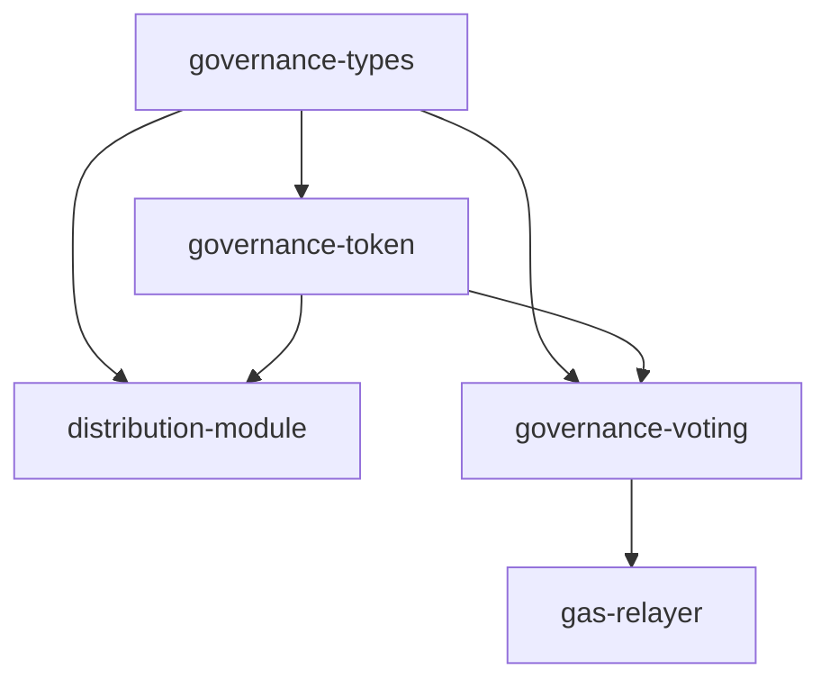
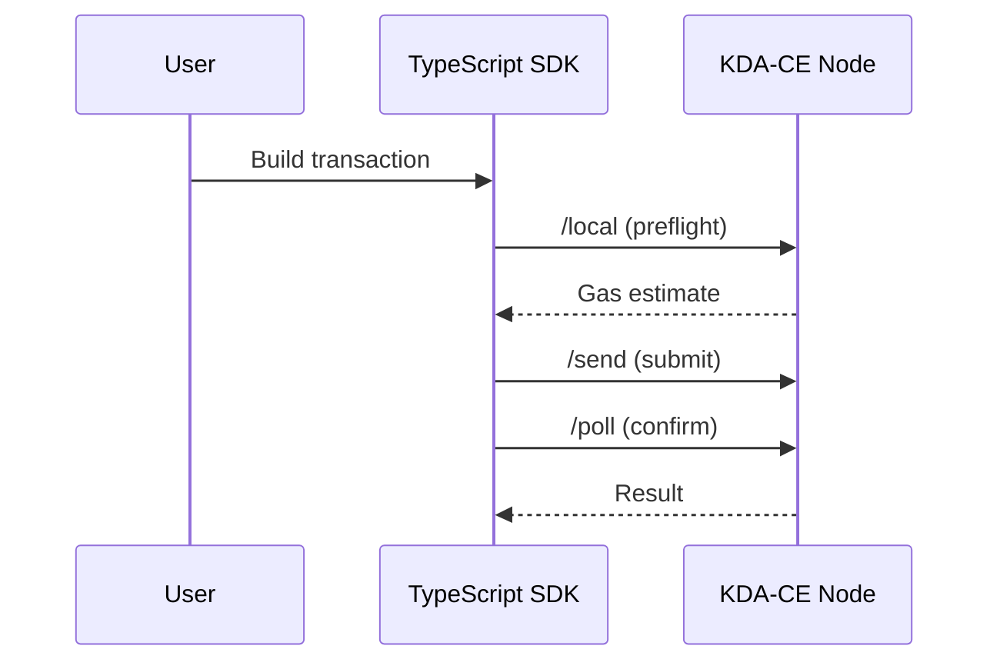

# Mermaid Diagram Generation

## Supported Diagram Types
- **flowchart** — Module relationships, deploy order, capability hierarchies
- **sequenceDiagram** — Transaction flows, cross-chain operations, agent communication
- **classDiagram** — Schema relationships, interface hierarchies
- **stateDiagram** — Proposal lifecycle, token states
- **erDiagram** — Table relationships across modules

## Conventions
- One concept per diagram — don't overload
- Use consistent colors per module
- Label all edges with relationship type
- Include gas costs on transaction flow edges where known

## Common Patterns

### Module Dependency DAG

### Transaction Flow

